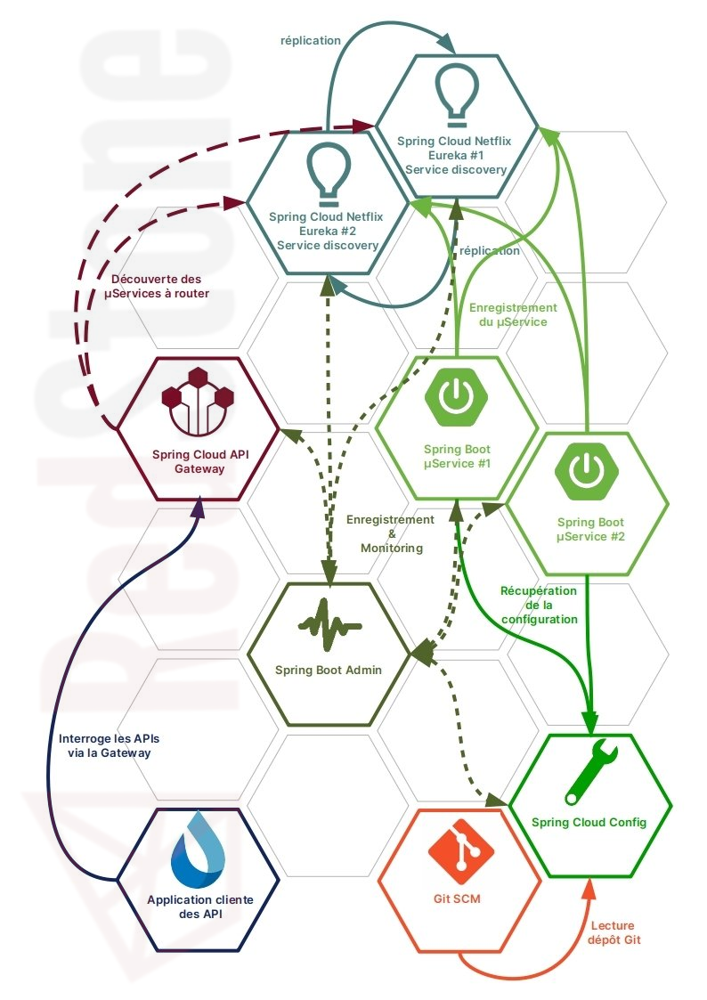

[](https://www.codefactor.io/repository/github/dvanderstoken/springsandbox)
[](https://dependabot.com)
[](https://github.com/DVanderstoken/springSandbox/issues)


# Spring / Spring Boot / Spring Cloud sandbox projects

### Big picture



Projects is completed with *Prometheus* and *Grafana*.

### Run projects

#### with Docker (prefered version):

```
mvn clean package [-DskipTests]
docker-compose up --build
```

Use *compatibility* mode if you're not using Docker Swarm : 

```
docker-compose --compatibility up --build
```

#### from command line:

```
./start-all.sh
```

| Module                          | Port  | URL                                                                                                                                                           |
| ------------------------------- | ----- | ------------------------------------------------------------------------------------------------------------------------------------------------------------- |
| Spring Boot Admin               | 10100 | http://localhost:10100                                                                                                                                        |
| Spring Cloud Gateway            | 10200 | http://localhost:10200/actuator/gateway/routes, http://localhost:10200/actuator/metrics/gateway.requests, http://localhost:10200/geolocation/api/v1/countries |
| Spring Cloud NetFlix Eureka #1  | 10300 | http://localhost:10300                                                                                                                                        |
| Spring Cloud NetFlix Eureka #2  | 10301 | http://localhost:10301                                                                                                                                        |
| Angular frontend                | 10400 | http://localhost:10400                                                                                                                                        |
| Spring Boot µService #1         | 10500 | http://localhost:10500/api/v1/countries                                                                                                                       |
| Spring Boot µService #2         | 10501 | http://localhost:10501/api/v1/countries                                                                                                                       |
| Spring Boot Application backend | 10600 | http://localhost:10600/api/v1/countries, http://localhost:10600/api/v1/players                                                                                |
| Spring Cloud Config Server      | 10800 | http://localhost:10800/geolocation/dockerpeer1/docker                                                                                                         |
| Prometheus                      | 9090  | http://localhost:9090/targets                                                                                                                                 |
| Grafana                         | 3000  | http://localhost:3000                                                                                                                                         |
