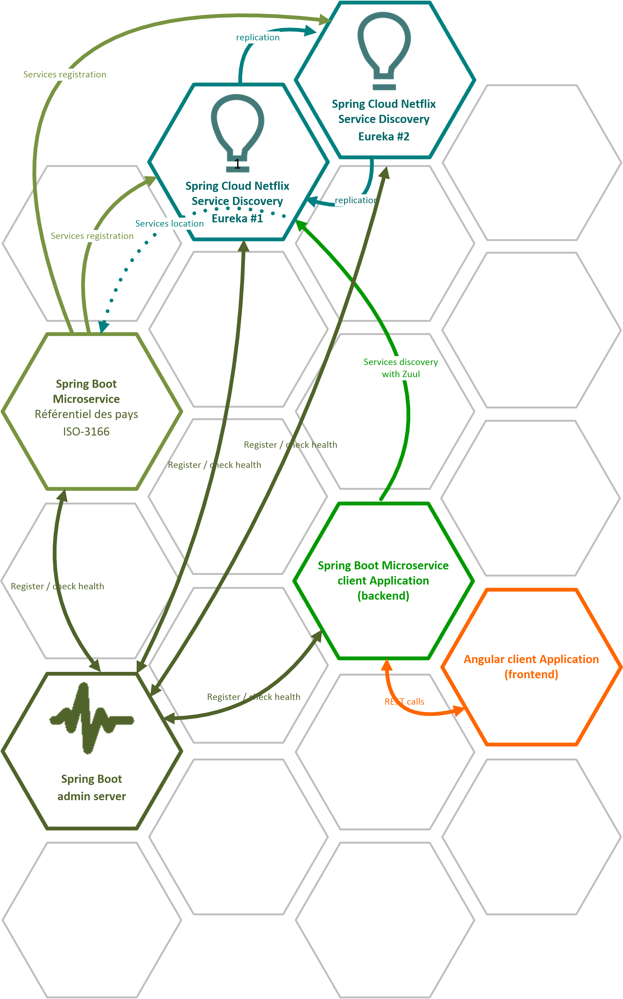

[](https://www.codefactor.io/repository/github/dvanderstoken/springsandbox)

[](https://lgtm.com/projects/g/DVanderstoken/springSandbox/alerts/)
[](https://lgtm.com/projects/g/DVanderstoken/springSandbox/context:javascript)
[](https://lgtm.com/projects/g/DVanderstoken/springSandbox/context:java)

[](https://github.com/DVanderstoken/springSandbox/issues)

[](https://dependabot.com)

# Spring / Spring Boot / Spring Cloud sandbox projects

### Big picture



### Run projects

From each maven sub-modules directory, launch with: `mvn spring-boot:run`

The `spring-cloud-netflix-eureka` sub-module uses one profile `peer1` or `peer2` : 
```
mvn spring-boot:run -Dspring-boot.run.profiles=peer{1|2}
```

Launch `ng-ms-client-frontend` app with :
```
yarn install
ng serve
```

To see Zuul fallback provider in action, stop the `spring-ms-countries` service and see what happens in your browser...
